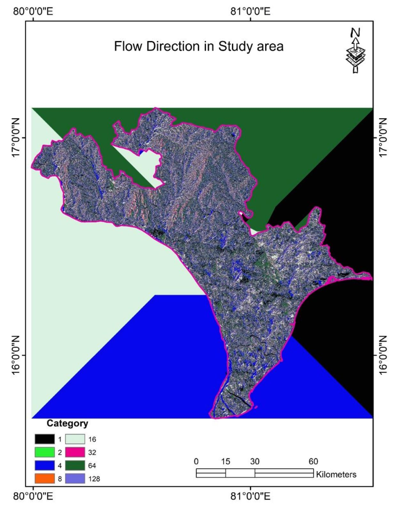
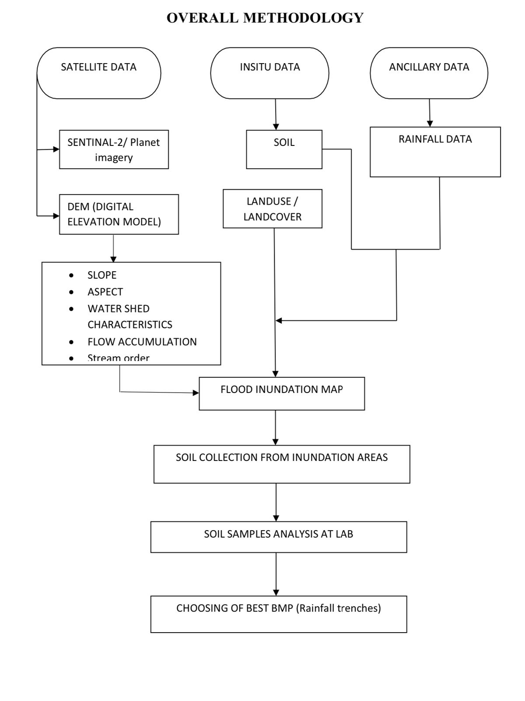

# Bachelors_project_D

# APPLICATIONS OF REMOTE SENSING AND BEST MANAGEMENT PRACTISE METHODSFOR FLOOD CONTROL MANAGEMENT IN FLOOD PRONE AREAS OF VIJAYAWADA

Flow direction in study area:

Abstract:

A flood is an overflow of water that submerges land when severe rainfall occurs.The flooding may occur as an over flow of water by heavy rainfall/snow storms/ water bodies such as rivers or lakes in which the water overtops and may result in some of that water escaping its usual boundaries. Floods cause severe damage to the infrastructure and human beings, if they occur in upslope areas and as catastrophic events. Some floods develop slowly, while others can occur in just 
a few minutes. Additionally, floods can be local, imparting a neighborhood or community, or very large, affecting entire river basin. However, the most affected areas by the floods are urban areas because of rapid urbanization. Floods in the urban areas can be controlled by using the best management practices (BMP’S), since they are highly effective and economic approaches to control the damages occurring by floods in urban areas. Hence a study is carried in Vijayawada,which is a major town of Andhra Pradesh after bifurcation. For the same, we utilized remote sensing and GIS datasets to find out the inundation zones and thus explored the suitable BMP’S to mitigate the flood. Among all the methods, the with moderate porosity characteristics are highly recommended for this region to avoid the floods

Overall methodology:

Result:

By considering the 5 available BMP’s, we are choosing RAIN BARRELS because the soil type is clay which takes long time to penetrate the water itself by which we can’t reduce the flood rate. Bio Retention type BMP is used in the fields and to construct the Infiltration Trenches, the place is not sufficiently available. Vegetated roofs are in practice in day to day life but not enough efficient to control the flood. Finally based on the based on the Soil condition, Density of Population, Land use / Land Cover Data,Type of Rain Fall, Climate, Amount of Rain Fall, Availability of land RAIN BARRELS is choosed as the best suitable BMP for that area.

